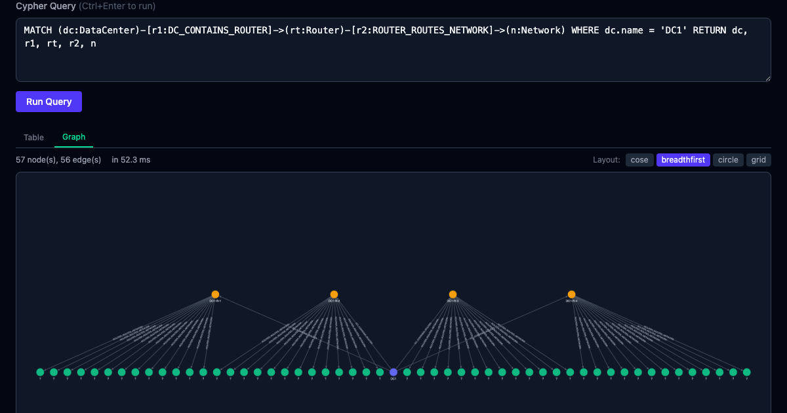

# GraphDB with WASM

A browser-based real-time graph database query preview app powered by [LadybugDB](https://ladybugdb.com/) (WASM).

Generates and queries ~100MB of network infrastructure graph data entirely in the browser — no server required.



**[Live Demo →](https://toyb0x.github.io/graph-db-wasm/)**

## Features

- **28万+ nodes / 47万+ edges** of network infrastructure graph data
- **Cypher queries** executed entirely client-side via WebAssembly
- **Graph visualization** with Cytoscape.js (4 layout algorithms)
- **Table & Graph views** for query results
- **~8–20ms** query response time on desktop browsers

## Tech Stack

- React 19 + TypeScript
- Vite
- Tailwind CSS v4
- kuzu-wasm (in-memory graph database via WebAssembly)
- Cytoscape.js (graph visualization)

## Getting Started

```bash
pnpm install
pnpm dev
```

1. Open http://localhost:5173 in your browser
2. DB initialization and seeding starts automatically (~30s)
3. After completion, click preset queries or write your own Cypher

## Data Model

Network infrastructure graph:

- **DataCenter** → Router, Rack
- **Router** → Network
- **Rack** → Switch, Machine
- **Machine** → Interface, Process
- **Interface** → Network, Port
- **Process** → SoftwareVersion, Port
- **Software** → SoftwareVersion

| Metric | Count |
|---|---|
| Nodes | 281,325 |
| Edges | 475,704 |
| Node tables | 11 types |
| Relationship tables | 12 types |
| Estimated DB size | ~96 MB |

## Note: kuzu-wasm dependency

This project uses [`kuzu-wasm@0.11.3`](https://www.npmjs.com/package/kuzu-wasm) as its graph database engine.

[KuzuDB](https://github.com/kuzudb/kuzu) was acquired by Apple and its open-source development has stopped. [LadybugDB](https://ladybugdb.com/) is the successor open-source project. However, the official npm package [`@lbug/lbug-wasm@0.13.1`](https://www.npmjs.com/package/@lbug/lbug-wasm) currently ships with a different API:

| Feature | kuzu-wasm (used) | @lbug/lbug-wasm |
|---|---|---|
| API style | Worker-based async API | Single-bundle Emscripten |
| Query | `conn.query()` → `QueryResult` | `conn.execute()` → Apache Arrow Table |
| Results | `getAllObjects()`, `getColumnNames()` | `table.toString()` (JSON) |
| Filesystem | `kuzu.FS` (writeFile, mkdir, unlink) | Internal Emscripten FS (no public API) |
| Worker | Separate file (`setWorkerPath`) | None (single-threaded) |

[LadybugDB/ladybug-wasm#7](https://github.com/LadybugDB/ladybug-wasm/pull/7) (async worker API) has been merged but not yet published to npm. Once released, migration to `@lbug/lbug-wasm` should be straightforward.

## Security

This application is a **front-end only sample application** with no backend server, authentication, or external API communication. All data is synthetic and generated in-memory on each browser session.

### Security Review History

| Date | Scope | Result | Reference |
|---|---|---|---|
| 2026-04-07 | Full codebase review | No vulnerabilities found | [#12](https://github.com/ToyB0x/graph-db-wasm/pull/12) |

## License

[MIT](LICENSE)
