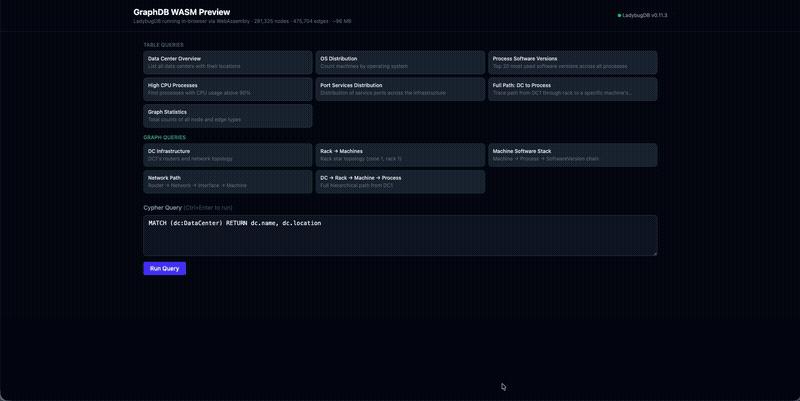
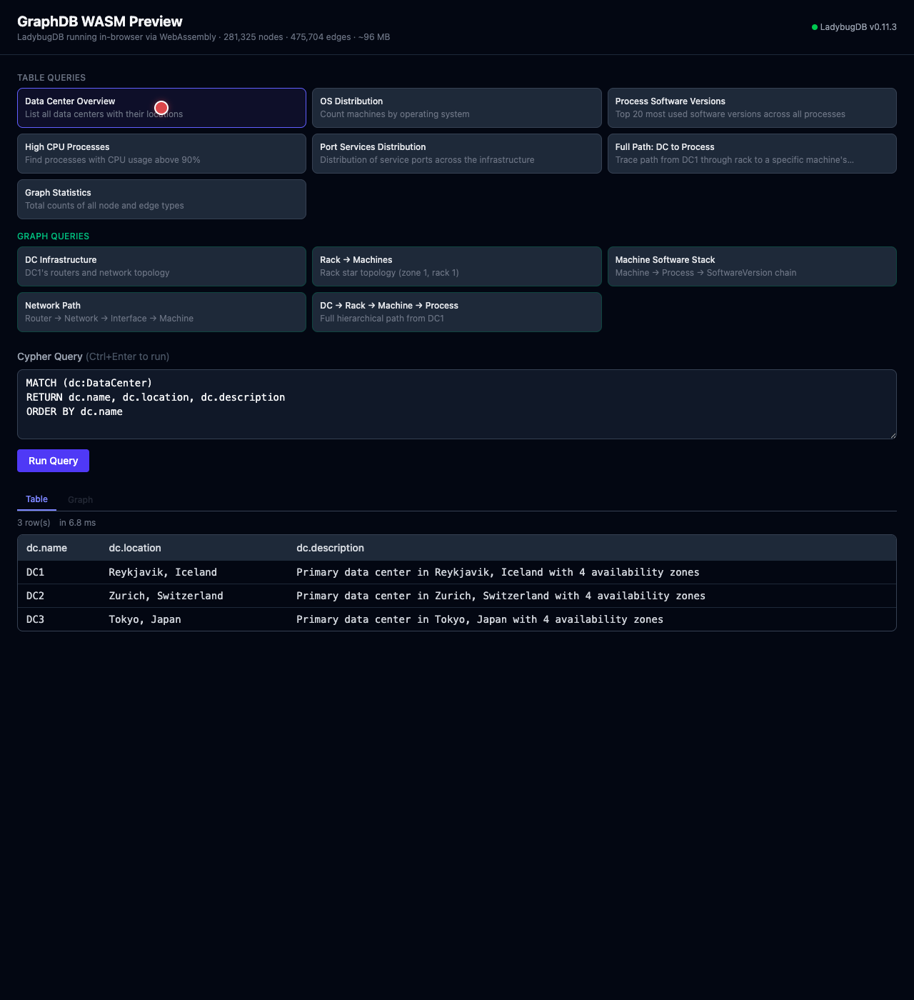
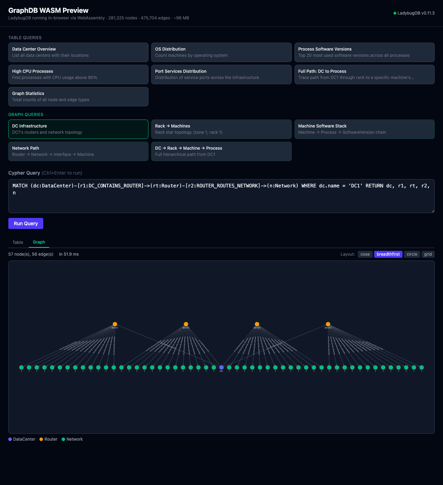

<!-- この記事は Claude Code によって生成されたベース原稿です -->
<!-- 投稿前に内容を確認・調整してください -->

**〜100MBのグラフデータをブラウザ上でリアルタイムにクエリする〜**



ブラウザ上で28万ノード・47万エッジのグラフデータベースをリアルタイムにクエリしている様子です。サーバーとの通信は一切なく、すべてWebAssemblyでクライアントサイド完結しています。

本記事では、このプロトタイプの技術選定から実装までの過程と、そこから得られた知見を共有します。

## はじめに

### グラフデータベースへの関心

数年前からグラフデータベースに注目しており、Neo4j、TigerGraph、Dgraphといった主要なグラフDBを、それぞれ程度の差こそあれ公私ともに使ってきました。リレーショナルDBでは表現しにくい「関係性」を第一級の概念として扱えるグラフDBは、ネットワーク構成管理や依存関係分析など、特定の領域で圧倒的な表現力を持っています。

### 軽量データベースのトレンド

一方で、近年はSQLiteやDuckDBに代表される「軽量なファイル型データベース」の活用が広がっています。サーバーを立てずにアプリケーション内に組み込めるこのアプローチは、開発の手軽さとデプロイの簡素さの両面で大きなメリットがあります。

DuckDBがブラウザ上でWASMとして動作する[DuckDB-WASM](https://duckdb.org/docs/api/wasm/overview)の事例が示すように、「ブラウザ内でDBエンジンを動かす」というアーキテクチャは、もはや実験的なものではなくなりつつあります。

### 本記事の動機

こうした背景から、「グラフデータベースもWASMでブラウザ上に持ってこられるのではないか」と考えました。グラフDBの持つ探索的なクエリ体験は、サーバーラウンドトリップなしにインタラクティブに操作できれば、より価値が高まります。

この仮説を検証するため、技術選定から簡易的なプロトタイプ実装までを行いました。

## WASMでデータベースを動かすメリット

「なぜわざわざブラウザでDBを動かすのか」という疑問に対して、技術的な観点から整理します。

### 1. クライアントサイドでの高速な閲覧

WASMで動作するDBエンジンは、クエリの発行から結果の取得までがすべてブラウザ内で完結します。ネットワークレイテンシが存在しないため、適切に実装されたWASM DBは数ミリ秒〜数十ミリ秒でクエリ結果を返します。

今回のプロトタイプでも、28万ノードに対するCypherクエリが**8〜20ms程度**で完了しており、サーバーサイドのグラフDBと同等以上のレスポンスが得られています。

### 2. サーバー負荷の軽減とスケーラビリティ

従来のアーキテクチャでは、すべてのクエリがサーバー上のDBインスタンスに集中します。ユーザー数が1,000、10,000と増加すれば、サーバーサイドのDB負荷はそれに比例して増大し、スケーリングのコストが問題になります。

WASMベースのアーキテクチャでは、処理が各ブラウザに分散されます。クライアント数が増えても、サーバー側でDBインスタンスを保持・スケールさせる必要がありません。これはRead-heavyなダッシュボードや分析ツールにおいて、インフラコストの構造的な削減につながります。

### 3. セキュリティリスクの原理的な低下

サーバーサイドのDBに対するSQLインジェクションやCypherインジェクションは、攻撃者がサーバー上のデータに不正アクセスする手段として深刻な脅威です。しかし、WASMでブラウザ内に閉じたDBの場合、クエリの対象は「そのユーザーのブラウザ内にあるデータ」に限定されます。

つまり、クエリインジェクションの攻撃面が構造的に消失します。攻撃者が任意のCypherを実行できたとしても、アクセスできるのは自身のブラウザ内のデータのみであり、他ユーザーのデータやサーバーリソースへの影響はありません。

:::message
もちろん、すべてのユースケースに適用できるわけではありません。サーバーサイドでの書き込み処理や、ユーザー間のデータ共有が必要なケースでは、従来のサーバーDB構成が必要です。WASMベースのDBは、Read-heavyな閲覧・分析用途と特に相性が良いアーキテクチャです。
:::

## 技術選定

### Gemini Deep Researchの活用

技術選定にあたり、Gemini Deep Researchを活用しました。技術選定の下調べにDeep Researchを活用するのは個人的に定着しつつあるワークフローで、特に以下の点で重宝しています。

- **ライブラリの成熟度とメンテナンス状況の確認**: GitHubのアクティビティ、リリース頻度、コミュニティの規模などを横断的に調査できる
- **比較マトリックスの作成**: 複数の選択肢を多項目で並列比較した表を生成でき、判断の土台として有用

また、技術調査は大量の情報の読み込みとコンテキストの保持が必要な作業であり、コーディングとは性質が異なります。調査をDeep Researchに、実装をClaude Codeにと**役割を分離する**ことで、それぞれのツールの強みを活かしやすいと感じています。

### 比較対象

WASMネイティブで動作するグラフデータベースとして、以下の4つを比較しました。

| データベース | アーキテクチャ | WASM対応 | 特徴 |
|:---|:---|:---|:---|
| **LadybugDB** | カラムナー・グラフ | 公式パッケージあり | Cypher対応、グラフアルゴリズム完備 |
| **CozoDB** | Datalog/ベクトル | あり | ベクトル検索+論理推論。ただしWASM版はグラフアルゴリズム不可 |
| **GraphQLite** | SQLite拡張 (Rust) | ビルドが必要 | 既存SQLiteにグラフ機能を追加。WASMパッケージなし |
| **Simple-Graph** | SQLiteスキーマ | SQLite経由 | 究極のポータビリティ。複雑な探索で性能低下 |

### LadybugDB（kuzu-wasm）の選定理由

LadybugDBを選定した主な理由は以下です。

1. **公式WASMパッケージの存在**: npm経由でインストール可能で、導入の障壁が低い
2. **Cypher対応**: Neo4jと同じクエリ言語が使えるため、グラフDB経験者にとって学習コストが低い
3. **Worker分離型の非同期API**: Web Workerで重い処理をオフロードし、メインスレッドのブロッキングを回避できる設計
4. **「グラフ版DuckDB」の設計思想**: DuckDBと同様の組み込み型軽量エンジンを志向しており、WASM×ブラウザという用途との相性が良い

:::message
KuzuDBはAppleに買収され、オープンソースとしての開発は停止しています。LadybugDBはその後続として立ち上がった新しいOSSプロジェクトです。本記事執筆時点では、npmパッケージは旧KuzuDB時代の`kuzu-wasm`を使用しています。公式パッケージ`@lbug/lbug-wasm`はAPI体系が異なるため、移行には上流の更新を待つ必要がありました。
:::

## 実装の流れ

実装はClaude Codeを活用し、16のPRを通じて段階的に進めました。コードの95%以上はClaudeによる生成ですが、開発のステップ設計とPR単位のアウトラインは自身で策定しています。

主要なマイルストーンは以下の通りです。

### Phase 1: 基盤構築（PR #1）

React + Vite + TypeScriptでSPAの基盤を構築し、kuzu-wasmの初期化とCypherクエリの実行基盤を実装しました。ネットワークインフラ管理を模したグラフスキーマ（DataCenter、Router、Machine等）を定義し、約100MBのシードデータを生成するパイプラインを構築しています。

### Phase 2: CI/CDとデプロイ（PR #3, #4）

TypeScript型チェックのCIワークフローと、GitHub Pages へのデプロイパイプラインを構築しました。

### Phase 3: 機能拡充と改善（PR #5, #6, #10）

スキーマの拡充（Interface、Network、SoftwareVersion等の追加）、ジェネレーターベースのバッチシーディングへの改善、プリセットクエリの整理、Cytoscape.jsによるグラフ可視化の実装を行いました。

### Phase 4: 品質と運用（PR #7〜#15）

依存関係のバージョンピン留め、ライセンス整備、セキュリティレビュー、UX改善（ファビコン追加、テーブルセルの可読性向上、プリセットのハイライト表示）など、プロダクション品質に近づけるための作業を実施しました。

## 詰まったポイントと解決策

### lbug-wasm → kuzu-wasm のAPI非互換

最初の大きなハードルは、WASMパッケージの選択でした。LadybugDBの公式npmパッケージ`@lbug/lbug-wasm`を導入しようとしたところ、APIの体系が想定と大きく異なることが判明しました。

| 項目 | kuzu-wasm（採用） | @lbug/lbug-wasm |
|:---|:---|:---|
| API方式 | Worker分離型非同期API | 単一バンドル型（Emscripten直接） |
| クエリ | `conn.query()` → `QueryResult` | `conn.execute()` → Apache Arrow Table |
| 結果取得 | `getAllObjects()`, `getColumnNames()` | `table.toString()` (JSON) |
| ファイルシステム | `kuzu.FS` (writeFile, mkdir) | Emscripten内部FS（公開APIなし） |

ドキュメントに記載されている非同期Worker APIが、現時点の公式パッケージにはまだ含まれていなかったため、旧KuzuDB時代の`kuzu-wasm@0.11.3`を使用する判断をしました。この判断の根拠と経緯はREADMEに文書化しています。

なお、非同期APIを含むPR（[LadybugDB/ladybug-wasm#7](https://github.com/LadybugDB/ladybug-wasm/pull/7)）は既にマージ済みであり、間もなく諸々の改善が入った新バージョンがnpmにリリースされるものと推測しています。公開され次第、`@lbug/lbug-wasm`への移行を検討したいと考えています。

### COOP/COEPヘッダーの対応

kuzu-wasmはWebAssemblyの`SharedArrayBuffer`を使用しており、これにはCross-Origin-Opener-PolicyおよびCross-Origin-Embedder-Policyヘッダーの設定が必要です。

開発環境ではViteの設定で対応できますが、GitHub PagesのようなStaticホスティングではサーバーのヘッダー設定を変更できません。この問題は`coi-serviceworker`を導入することで解決しました。Service Workerがレスポンスヘッダーを動的に付与する仕組みです。

```typescript
// vite.config.ts（開発環境）
server: {
  headers: {
    "Cross-Origin-Opener-Policy": "same-origin",
    "Cross-Origin-Embedder-Policy": "require-corp",
  },
},
```

:::message alert
筆者はこのService Workerを利用した設定にあまり詳しくなく、今回は調査の時間も取らなかったため、一旦動作させることを優先しました。プロダクション環境で使用する場合は、これらのヘッダー設定の意味や妥当性をご自身でお調べになることをお勧めします。
:::

## 完成したもの

### プリセットクエリの実行

テーブルクエリとグラフクエリの2種類のプリセットを用意しています。クエリの実行結果はテーブルビューとグラフビューで切り替えて閲覧できます。



### グラフ可視化

グラフクエリの結果はCytoscape.jsで可視化しています。ノードの種類に応じて色分けされ、cose、breadthfirst、circle、gridの4つのレイアウトアルゴリズムを切り替えて表示できます。



### データ規模

| 指標 | 値 |
|:---|:---|
| ノード数 | 281,325 |
| エッジ数 | 475,704 |
| データサイズ | 約96MB |
| ノードテーブル | 11種類（DataCenter, Router, Rack, Machine, Process等） |
| リレーションシップ | 12種類 |

これらのデータはすべてブラウザ内でシーディング時に生成される合成データです。データベースは完全にインメモリで動作しており、ディスクへの書き込みは一切行いません。ブラウザを閉じればデータは消えるため、端末への永続的な影響もありません。

### モバイル端末での動作

デスクトップブラウザでの動作は当然として、比較的安価なスマートフォン（Motorola Edge 50s Pro）でも動作を確認しました。

軽量なクエリ（Data Center OverviewやOS Distribution等）は**約20ms**で完了し、デスクトップとほぼ遜色ないレスポンスが得られます。最も重い統計クエリでも**約1.2秒**で結果が返り、実用上問題のない範囲でした。

Mac版Google Chromeのタスクマネージャーで確認したところ、ページ読み込み直後のシードデータ生成・投入段階では**約900MB**のメモリを消費しますが、シーディング完了後は**約440MB**程度に落ち着きました。

比較的安価なミドルレンジのスマートフォンでも28万ノードのグラフDBをインタラクティブに操作できたことは、WASMベースのクライアントサイドDBの実用性を裏付ける結果です。ただし、一部の古い端末では動作しない可能性もあります。

## AI活用の所感

### 技術選定: Deep Research

前述の通り、Gemini Deep Researchを技術選定の初期調査に使用しました。特に「WASMネイティブで動作するグラフDB」という比較的ニッチな領域の調査において、候補の洗い出しと比較マトリックスの作成に効果を発揮しました。

調査フェーズとコーディングフェーズでは求められるコンテキストの種類が異なるため、ツールを分離する設計は効率的です。

### 実装: Claude Code

コードの95%以上はClaude Codeで生成しています。ただし、開発のステップ設計（PR単位でのスコープ定義）は自身で行い、各PRのアウトラインを自然言語で記述した上でClaude Codeに実装を指示するワークフローを取りました。

このアプローチにより、以下の利点が得られました。

- **意思決定の主体を保持**: 「何をやるか」は人間が決め、「どう実装するか」をAIに委ねる分離
- **レビュー可能な粒度**: PR単位で差分を確認でき、AIが生成したコードの品質管理が可能
- **高速なイテレーション**: 16PRを短期間で完了し、プロトタイプの検証サイクルを高速に回せた

## まとめ

### 主要な知見

本プロトタイプの実装を通じて、以下の知見が得られました。

- **WASMグラフDBの実用性**: 28万ノード規模のグラフデータに対して、ブラウザ内で8〜20msのクエリレスポンスが得られる。Read-heavyな用途では十分に実用的
- **アーキテクチャ上のメリット**: サーバー負荷の分散、セキュリティリスクの構造的低下、デプロイの簡素化など、クライアントサイドDB特有の利点がグラフDBにも適用される
- **エコシステムの過渡期**: WASMグラフDB分野はまだ成熟途上にあり、パッケージのAPI安定性やドキュメントの充実度に課題が残る。ただし、LadybugDBの開発は活発であり、今後の改善が期待できる

### 今後の展望

- **OPFSによる永続化**: 現在はインメモリのみだが、Origin Private File Systemを活用すれば、ブラウザを閉じてもデータを保持できる可能性がある
- **公式パッケージへの移行**: `@lbug/lbug-wasm`の非同期APIが公開された際には移行を検討
- **実データでの検証**: 合成データではなく、実際のユースケース（例: OSS依存関係の可視化、ナレッジグラフの探索）への適用

## 参考リンク

- [LadybugDB公式ドキュメント](https://docs.ladybugdb.com/)
- [kuzu-wasm (npm)](https://www.npmjs.com/package/kuzu-wasm)
- [DuckDB-WASM](https://duckdb.org/docs/api/wasm/overview) — ブラウザ内DBの先行事例
- [本プロジェクトのリポジトリ](https://github.com/ToyB0x/graph-db-wasm)

## 免責事項

- 本記事の検証結果は特定の環境・データ規模での結果であり、実際の適用時は各環境での検証を推奨します
- 本記事はLLMと手書きを併用して作成しました
